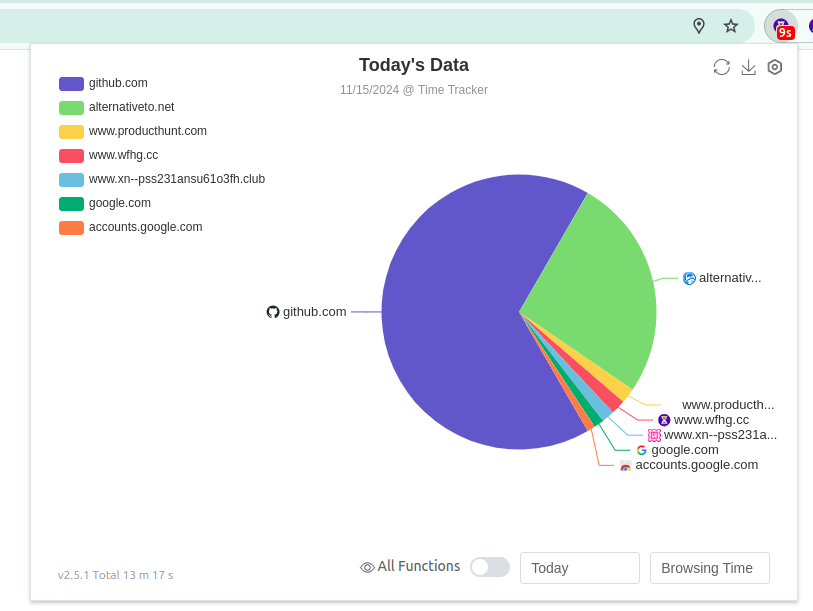
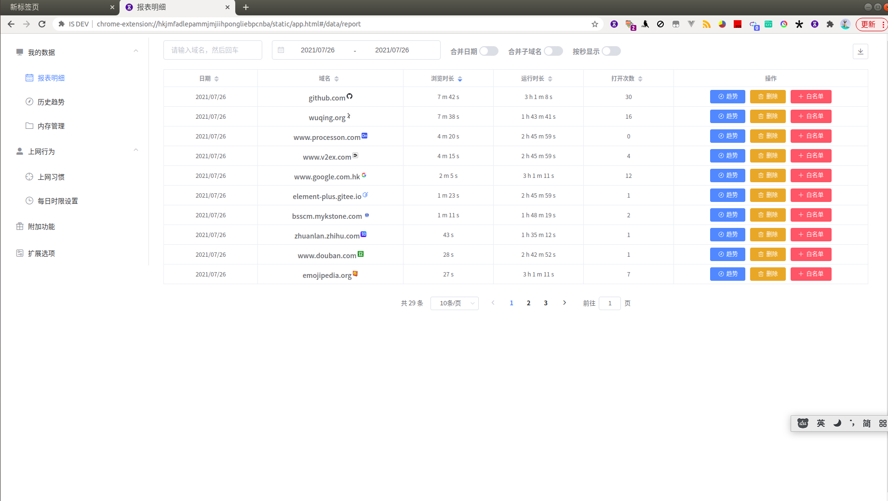

# 网费很贵

\[ 简体中文 | [English](./README-en.md) \]

网费很贵是一款用于上网时间统计的浏览器插件，使用 webpack，TypeScript 和 Element-plus 进行开发。你可以在 Firefox，Chrome 和 Edge 中安装并使用它。

- 统计网站的运行时间
- 统计用户在不同网站上的浏览时间
- 统计用户打开网站的次数
- 统计用户阅读本地文件的时间
- 限制每天浏览指定网站的时间
- 网站白名单，过滤不需要统计的网站
- 自定义域名合并统计的规则
- 分时段统计分析用户的上网行为并以直方图展示
- 报表导出

## 下载地址

## 截图

> 弹窗页展示今日数据

	

> 所有功能

	

---

详细展示图文：[douban.com](https://www.douban.com/group/topic/213888429/)

## 贡献指南

如果你想参与到该项目的开源建设，可以考虑以下几种方式

#### 提交 Issue

如果您有一些好的想法，或者 bug 反馈，可以新建一条 [issue](https://github.com/sheepzh/timer/issues) 。作者会在第一时间进行回复。

#### 参与开发

如果你知道如何开发浏览器扩展，并且熟悉该项目的技术栈 ( TypeScript + vue3 + ElementPlus )，也可以贡献代码

参见[开发指南](./doc/dev-guide.md)。

> 当然也欢迎新手同学使用该项目作为学习项目自己练手

#### 完善翻译

除了简体中文外，该扩展另外的本地化语言都依赖机翻。所以也非常欢迎您在 [issue](https://github.com/sheepzh/timer/issues/new?assignees=&labels=locale&template=translation-------.md&title=Report+translation+mistakes) 里提交翻译建议。

#### 好评鼓励

至于最简单粗暴的贡献方式，当然是在 [Firefox](https://addons.mozilla.org/zh-CN/firefox/addon/web%E6%99%82%E9%96%93%E7%B5%B1%E8%A8%88/) / [Chrome](https://chrome.google.com/webstore/detail/%E7%BD%91%E8%B4%B9%E5%BE%88%E8%B4%B5-%E4%B8%8A%E7%BD%91%E6%97%B6%E9%97%B4%E7%BB%9F%E8%AE%A1/dkdhhcbjijekmneelocdllcldcpmekmm) / [Edge](https://microsoftedge.microsoft.com/addons/detail/timer-the-web-time-is-e/fepjgblalcnepokjblgbgmapmlkgfahc) 好评三连啦 XXD

## 致谢

