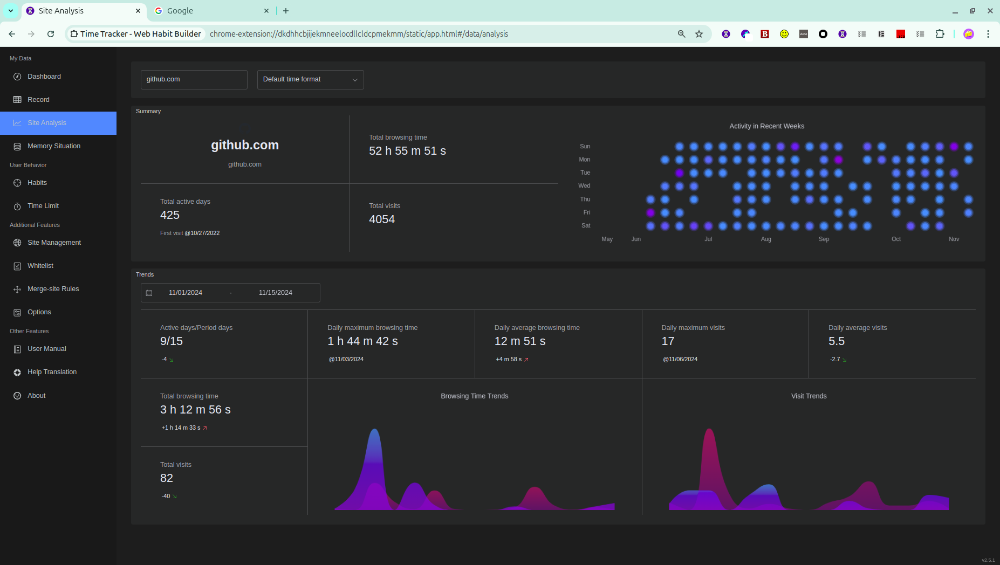
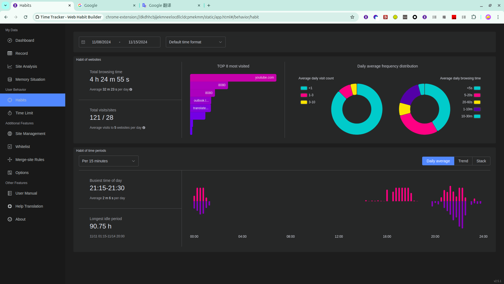

# Time Tracker

\[ English | [简体中文](./README-zh.md) \]

Time Tracker is a browser extension to track the time you spent on all websites. It's built by webpack, TypeScript and Element-plus. And you can install it for Firefox, Chrome and Edge.

## Install

[How to install manually for Safari](./doc/safari-install.md)

## Screenshots

    
    
Pie Chart on the Popup Page

    
    
Dashboard

    
    
Analytical Report

    
    
Habit Report

## Contribution

There are some things you can do to contribute to this software.

#### 1. Submit issues

You can [submit one issue](https://github.com/sheepzh/timer/issues) to us if you have some suggestions, feature requests, or feedback of bugs. And we will reply it as soon as possible.

#### 2. Participate in development

If you know how to develop browser extensions and are familiar with the project's technology stack ( TypeScript + vue3 + ElementPlus ), you can commit your code lines.

#### 3. Perfect translation

In addition to Simplified Chinese, the other localized languages of this software all rely on machine translation. You can also submit translation suggestions on [Crowdin](https://crowdin.com/project/timer-chrome-edge-firefox).

#### 4. Rate 5 stars

[Firefox](https://addons.mozilla.org/zh-CN/firefox/addon/web%E6%99%82%E9%96%93%E7%B5%B1%E8%A8%88/) / [Chrome](https://chrome.google.com/webstore/detail/%E7%BD%91%E8%B4%B9%E5%BE%88%E8%B4%B5-%E4%B8%8A%E7%BD%91%E6%97%B6%E9%97%B4%E7%BB%9F%E8%AE%A1/dkdhhcbjijekmneelocdllcldcpmekmm) / [Edge](https://microsoftedge.microsoft.com/addons/detail/timer-the-web-time-is-e/fepjgblalcnepokjblgbgmapmlkgfahc)

It's simple and much helpful!

## Thanks

